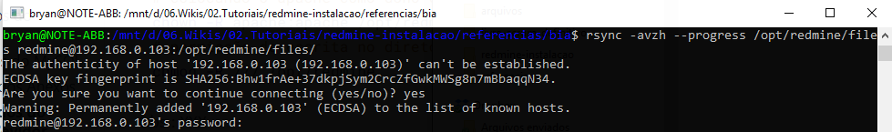
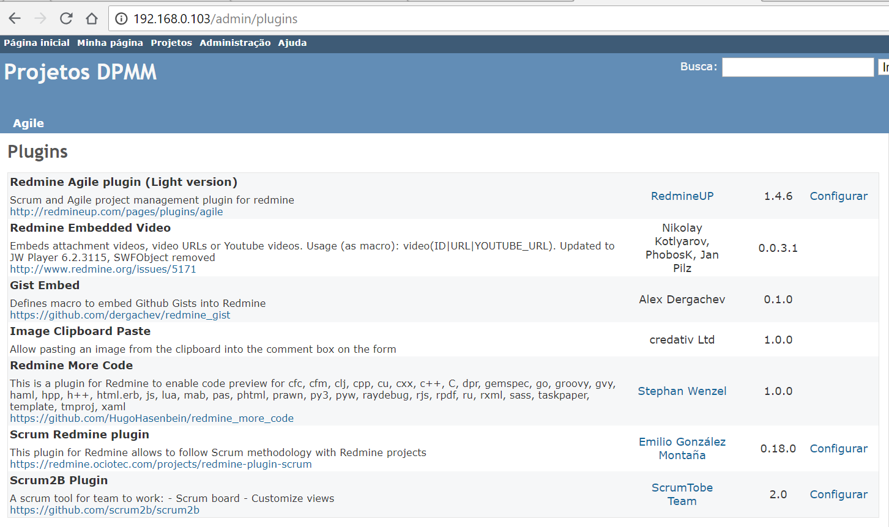
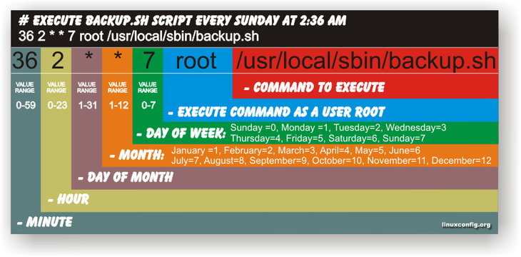

#  Administração do Redmine no Oracle Linux 7+

<div style="text-align:center" markdown="1">
  
</div>
> Autor: 1T (T) Anders - DAbM

##  1. Introdução
Este documento destina-se a orientação de administração do **Redmine** no sistema operacional Oracle Linux 7 com Banco de Dados MySQL, em servidores da DAbM.

**Pré requisitos:**
- Sistema Operacional: Oracle Linux 7.3 com ao menos Interface gráfica selecionada.

## 2. Exportação dos dados do Redmine

Os backups do Redmine devem incluir:

- **dados** (armazenados em seu banco de dados redmine).
- **anexos** (armazenados no diretório `files` da sua instalação Redmine), ou entro local que tenha configurado no momento da instalação do Redmine, ver manual de instalação para isso.

###  2.1 Exportando dados do MySQL

Certifique de desativar temporariamente as ferramentas de segurança do Linux, a fim de evitar problemas no processo de backup do dados. Esses problemas são em grande parte silenciosos e podem ser causados por ferramentas como ACLs estendidas, **SELinux** ou AppArmor.

O comando`mysqldump` pode ser usado para fazer **backup** do conteúdo do banco de dados MySQL em um arquivo de texto. Por exemplo: 

```bash
# Script Autor: 1T (T) Anders
# sintaxe:
#/usr/bin/mysqldump -u <username> -p<password> -h <hostname> <redmine_database> > /path/to/backup/db/redmine.sql

# exemplo de uso:
# cria a pasta, ou substitua pela sua pasta onde está dump no seu servidor
mkdir -p /opt/redmine/dump/
# configura a data
now=$(date +"%d_%m_%Y_%H%M%Sh")
# configura o arquivo
file_sql="/opt/redmine/dump/backup_redmine_${now}.sql"
# Backup Database sem compactação
mysqldump -uroot -p<senha_root_mysql> redmine > "$file_sql"
# ou
mysqldump -uroot -p redmine > "$file_sql"
Enter password: *****
```

**Nota:** `dump` é uma palavra comum em banco de dados que representa um cópia (backup) do banco de dados.

### 2.2 Fazendo backup dos Anexos

Todos os uploads de arquivos são armazenados em `attachments_storage_path`(padrão para o diretório`files/`). Você pode caopiar o conteúdo desse diretório para outro local para fazer backup facilmente. 

**NOTA:** `attachments_storage_path`pode apontar para um diretório diferente que não seja `files/`. Certifique-se de verificar a configuração `config/configuration.yml`para evitar fazer um backup inútil. Se você seguiu o manual de instalação anterior, a pasta que contém o anexos do upload é o `/opt/redmine/files`. Caso esteja copiando para outro servidor não esqueça de colocar o **usuário** `apache` como dono do diretório `/opt/redmine`.

Neste cenário, o comando usado para fazer a cópia da pasta `/opt/redmine/files` é o **rsync**, pois além de copiar com mair rapidez, preserva links simbólicos, permissões de arquivos, posses usuário e grupo e timestamps, para mais informações acesse o site: [https://e-tinet.com/linux/sincronizacao-de-arquivos-no-linux-rsync/](https://e-tinet.com/linux/sincronizacao-de-arquivos-no-linux-rsync/)

```bash
# se não estiver instalado o rsync (para distribuições baseadas em Red Hat)
yum install rsync
# Backup do anexos em mesmo servidor (localmente)
rsync -a /opt/redmine/files /path/to/backup/files
rsync -avzh --progress /opt/redmine/files /path/to/backup/files

# colocando o apache como dono do diretório no outro servidor
chown -R apache:apache /opt/redmine
# permissão de escrita no diretório
chmod -R 777 /opt/redmine
```
## 3. Importação dos dados do Redmine para outro Sevidor  

### 3.1 Import DB Redmine no MySQL
Para importar o dump em algum banco de dados do MySQL, basicamente é utilizada a mesma sintaxe, porém  deve-se usar o comando `mysql`em vez do `mysqldump`. Também dev-se utilizar o símbolo da seta para esquerda '<' que indica o arquivo de entrada.

**NOTA 1:** O símbolo da seta para direita **'>',** representa um **arquivo de saída**. O símbolo da seta para esquerda **'<'**, representa um **arquivo de entrada**.

A seguir, podemos ver a sintaxe do comando para importar o arquivo de backup.

```bash
# copiando o arquivo sql de backup do servidor de produção 
# para o servidor do redmine instalado, o comando abaixo foi executado,
# partindo do princípio que o arquivo '.sql' está na mesma raiz do comando
rsync -avzh redmine.sql root@192.168.0.103:/opt/redmine/dump/
# ou c/scp
scp redmine.sql redmine@192.168.0.103:/opt/redmine/dump/

# sintaxe:
# mysql -uroot -p redmine_db < /path/to/backup/db/redmine.sql
# se ao restaurar não existir o banco de dados ocorrerá um erro conforme exemplo:
mysql -uroot -p redmine_db < redmine.sql 
Enter password: ****
ERROR 1049 (42000): Unknown database 'redmine_db'
# Caso já possua o banco do redmine, então entre c/nome do BD correto, conforme exemplo:
mysql -uroot -p redmine < redmine.sql 
Enter password: ****

# Só execute o comando abaixo caso você não tenha um banco de dados 
# já criada do redmine
# Para criar um banco de dados novo, execute: 
mysql -u root -p -e "create database test_redmine_db";
```

**NOTA 2:** Ao concluir a importação, **caso não exista** um usuário redmine, será necessário criar um novo usuário **redmine** e conceder os privilégios para que ele use o banco que foi importado. Se existir, basta somente conceder os privilégios, conforme código abaixo:

```bash
# acesse o banco msyql
mysql -uroot -p
Enter password: senha-do-root-do-mysql

# Passo 1- comando para 'criar o usuário' do redmine e senha. Nesta etapa é bom que seja criado o mesmo usuário e senha do redmine que foi criado no manual, para que não precise editar o arquivo de configurações do redmine a fim de repassar a senha nova.
# ---------------------------------------------
mysql> GRANT ALL PRIVILEGES ON redmine.* TO 'redmine'@'localhost' IDENTIFIED BY 'SenhaDoRedmine@2018';
# aplicando privilégios
mysql> FLUSH PRIVILEGES;

# ou
# Passo 2 - Caso já possua o usuário no novo banco de dados mysql, desconsidere o comando acima e execute o seguinte comando:
# ---------------------------------------------
mysql> GRANT ALL PRIVILEGES ON redmine.* to 'redmine'@'localhost';
mysql> FLUSH PRIVILEGES;
mysql> \q;
```

### 3.2 Restore do backup dos Anexos

Para copiar os anexos que são armazenados em `attachments_storage_path`(padrão para o diretório`files/`). Basta copiar conforme o item descrito no **Passo do item 2.2** para o novo Servidor e alterar para que o usuário **apache** seja dono da pasta em `attachments_storage_path` ( no manual de instalação foi `/opt/redmine`).

```bash
##################### SERVER REMOTE ##################
# Restore dos anexos de um servidor Remoto para o servidor onde está o redmine instalado
# com o user redmine
rsync -avzh --progress opt/redmine/files/ redmine@192.168.0.103:/opt/redmine/files/
# ou com user root
rsync -avzh opt/redmine/files/ root@192.168.0.103:/opt/redmine/files/
root@192.168.0.103's password: ****
#
# Você pode copiar também com o scp, porém este nao irá preservar os direitos dos arquivos
scp -r opt/redmine/files/* redmine@192.168.0.103:/opt/redmine/files/
redmine@192.168.0.103's password: ****
##################### SERVER REMOTE ##################
# alterando a permissao dos arquivos caso necessite
chown -R apache:apache /opt/redmine
```



## 4. Instalação de Plugins no Redmine (Opcional)

Nesta seção iremos apresentar alguns plugins úteis para utilização no Redmine 3.3.0. Para instalar plugins no redmine basta seguir as orientações no link http://www.redmine.org/projects/redmine/wiki/Plugins. Iremos mostrar de um modo geral como funciona para instalar plugins:

#### Plugins - Lista de plugins

Uma lista completa de plugins Redmine disponíveis pode ser encontrada no [Diretório de Plugins](http://www.redmine.org/plugins). 

#### Instalando um plugin qualquer...

**Não precisa executar os comandos abaixo**, pois é um `exemplo` de uma instalação de um plugin qualquer.

1. Copie para o diretório ` /path/to/redmine/plugins`(Redmine 2.x) o plugin desejado ou também poderá copiar o plugin direto do GitHub da seguinte forma: `git clone git://github.com/user_name/name_of_the_plugin.git`, basta fazer as mudanças necessárias.

2. Se o plug-in exigir uma migração, execute o seguinte comando `/path/to/redmine/`para atualizar seu banco de dados (faça um backup do banco de dados antes).

   2.1. Para Redmine 2.x:

```
bundle exec rake redmine:plugins:migrate RAILS_ENV=production
```

3. Reinicie Redmine

Agora você deve conseguir ver a lista de **plugins** em *Administração -> Plugins* e configurar o plug-in recém-instalado (se o plug-in precisar ser configurado). Para mais detalhes acesse o site [Install Plugins Redmine](http://www.redmine.org/projects/redmine/wiki/Plugins).

### 4.1 Instalando plugin - Redmine Image Clipboard Paste

Plugin para redmine que permite colar dados de imagem da área de transferência diretamente no campo de entrada de comentários em um novo chamado ou comentário. A imagem receberá um nome de arquivo aleatório e será adicionado como um anexo e também inserido no texto do comentário usando a linguagem de marcação do Redmine.  Para mais detalhes acesse: https://github.com/credativUK/redmine_image_clipboard_paste

Para instalar o plugin, clone do github e migre o banco de dados: 

```bash
cd /var/www/redmine
# clonando e copiando para o diretorio especifico
git clone git://github.com/credativUK/redmine_image_clipboard_paste.git plugins/redmine_image_clipboard_paste
# dentro da raiz do redmine execute
# volta para pagina do redmine
cd /var/www/redmine
bundle install
# depois instale o plugin
[18:04] root@localhost /var/www/redmine
$ bundle exec rake redmine:plugins:migrate RAILS_ENV=production
Migrating redmine_image_clipboard_paste (Image Clipboard Paste)...
# agora reinicie o servidor httpd
systemctl restart httpd.service
#ou
service httpd restart
```

Para desinstalar o plug-in, migre o banco de dados de volta e remova o plug-in: 

```bash
# navegue até o redmine
cd /var/www/redmine
# execute o comando para migrar o bd de volta
bundle exec rake redmine:plugins:migrate NAME=redmine_image_clipboard_paste VERSION=0 RAILS_ENV=production
# remova a pasta do plugin
rm -rf plugins/redmine_image_clipboard_paste
```

### 4.2 Instalando plugin - Redmine Embedded Video.

Plugin Embedded Video serve para fazer visualizar vídeos no Wiki do Redmine, muito útil  para criar Wikis de tutoriais em vídeos. Para mais informações acesse [Home Page](http://www.redmine.org/plugins/redmine_embedded_video)ou [GitHub](https://github.com/cforce/redmine_embedded_video).

```bash
# navegue até o redmine
cd /var/www/redmine/plugins
# caso exista algum pasta antiga do plugin
rm -rf redmine_embedded_video
# crie a pasta
mkdir -p redmine_embedded_video
# baixe do github
wget -nv https://github.com/cforce/redmine_embedded_video/archive/master.tar.gz -O - | tar -zvxf - --strip=1 -C redmine_embedded_video
# volte para raiz do redmine e execute
# volta para pagina do redmine
cd /var/www/redmine/
[18:36] root@localhost /var/www/redmine
$ bundle exec rake redmine:plugins:migrate RAILS_ENV=production
Migrating redmine_embedded_video (Redmine Embedded Video)...
Migrating redmine_image_clipboard_paste (Image Clipboard Paste)...
# reincie o httpd
service httpd restart
```

Para usar o plugi basta no documento do wiki usar da seguint maneira:

```markdown
# Sintaxe:
{{video(<ATTACHEMENT>|<URL>|<YOUTUBE_URL>[,<width>,<height>])}}

Para URLs externos, basta usar o URL completo do vídeo:
{{video(http://youtu.be/o9aA9wCQ9co)}}

Você pode antes de largura e altura de vídeo:
{{video(http://youtu.be/o9aA9wCQ9co[640,480])}}

Para escala relativa, basta digitar um valor:
{{video(http://youtu.be/o9aA9wCQ9co[640,])}}

Para vídeos anexados, não use nenhum caminho na frente do nome do arquivo do anexo:
{{video(History.flv)}}
{{video(vid.swf)}}
```

### 4.3 Instalando plugin - Line numbers Redmine.

Plugin Redmine que ativa numeração de linha em blocos de código e adiciona um botão de alternância para ligar/desligar. A alternância é útil se você quiser copiar e colar o código de um site Redmine sem copiar os números de linha. [Home Page Pugin](https://github.com/cdwertmann/line_numbers).

```bash
# navegue até o redmine
cd /var/www/redmine/plugins
rm -rf line_numbers
mkdir -p line_numbers
wget -nv https://github.com/cdwertmann/line_numbers/archive/master.tar.gz -O - | tar -zvxf - --strip=1 -C line_numbers
# basta reinicar o servidor apache
service httpd restart
```

### 4.4 Instalando plugin - Gist Embed Redmine.

Plugin Redmine para adicionar algum conteúdo interessante di **gist** do github. [Home Page](https://github.com/dergachev/redmine_gist).

```bash
# navegue até o redmine
cd /var/www/redmine/plugins
rm -rf redmine_gist
mkdir -p redmine_gist
wget -nv https://github.com/dergachev/redmine_gist/archive/master.tar.gz -O - | tar -zvxf - --strip=1 -C redmine_gist
# basta reinicar o servidor apache
service httpd restart
```

### 4.5 Instalando plugin para o SCRUM.

Neste tópico irei demonstrar **3 execelentes plugins** para trabalhar com o SCRUM no Redmine 3+. Existem outros plugins para o SCRUM e Kanban, fique a vontade.

#### 4.5.1 Plugin Scrum2b - [GitHub](https://github.com/scrum2b/scrum2b)

**Scrum2B Tool** é um aplicativo de Gerenciamento de Projetos, especializado em projetos Scrum/Ágil e de Desenvolvimento de Software, sendo utilizado e mantido pela [ScrumTobe Software]( <https://www.facebook.com/ScrumTobe> ). O Scrum2B Tool é construído como um plugin do [www.redmine.org](http://www.redmine.org/), livre para usar. 

Passos para instalação:

```bash
# navegue até o redmine
cd /var/www/redmine/plugins
#clonando o projeto
git clone https://github.com/scrum2b/scrum2b.git
# volta para pagina do redmine
cd /var/www/redmine/
# instalando dependencias
bundle install
# executando a migração
bundle exec rake redmine:plugins:migrate RAILS_ENV=production
# basta reinicar o servidor apache
service httpd restart
```

Para aprender a usar o plugin sugiro um estudo nos sites: 

- http://agiledesk.herokuapp.com/projects/it-weshop-helpdesk/roadmap;
- https://github.com/scrum2b/scrum2b/wiki/Installation-Guide
- https://github.com/scrum2b/scrum2b/wiki/Screens

#### 4.5.2 Redmine SCRUM plugin - [Redmine Page Plugin](http://www.redmine.org/plugins/scrum-plugin#Sprint-board-screenshot)

Um dos **melhores** plugins de SCRUM para o redmine, ele é Open Source, e mantido pelo desenvolvedor [Emilio Gonzáles](https://www.patreon.com/ociotec), que pede contribuição para que gostaria de ajudá-lo. O plugin encontra-se na **versão 0.18.0 released** já com suporte ao **redmine 3.4+**, conforme [notícia no site de release do plugin](https://redmine.ociotec.com/news/15). 

O [Wiki do plugin](https://redmine.ociotec.com/projects/redmine-plugin-scrum/wiki) explica como instalar, configurar o plugin. Para usar com o plugin sugiro acessar o link do redmine do desenvolvedor para ver [como trabalhar com o SCRUM no Redmine](https://redmine.ociotec.com/projects/redmine-plugin-scrum/wiki/How_it_works).

Para instalar siga os passos:

```bash
# navegue até o redmine
cd /var/www/redmine/plugins
rm -rf scrum
mkdir -p scrum
wget -nv https://redmine.ociotec.com/attachments/download/476/scrum-v0.18.0.tar.gz -O - | tar -zvxf - --strip=1 -C scrum
# volta para pagina do redmine
cd /var/www/redmine/
# executando a migração
bundle exec rake redmine:plugins:migrate RAILS_ENV=production
# basta reinicar o servidor apache
service httpd restart
```

#### 4.5.3 Redmine Agile Plugin: One tool to manage all your projects - [Redmine Agile](http://www.redmine.org/plugins/redmine_agile)

Uma excelente ferramenta para gerenciar os projetos em SCRUM. Este plugin tem uma [**versão free**](https://www.redmineup.com/pages/plugins/agile) que é a que iresmos instalar e outras [versões pagas](https://www.redmineup.com/pages/plugins/agile/pricing). Permite o uso das melhores práticas ágeis de qualquer metodologia - Scrum, Kanban ou misto. 

Passos para instalação da **versão free**, temos que cadastrar o email e baixar pelo email o plugin e depois copiar para o servidor - [Link de instalação](https://www.redmineup.com/pages/help/agile/installing-redmine-agile-plugin-on-linux). Para usar o plugin sugiro que acesse o [Getting Started do Plugin](https://www.redmineup.com/pages/help/agile).

```bash
# copiando da maquina local para o servidor
scp redmine_agile-1_4_6-light.zip root@192.168.0.103:/var/www/redmine/plugins
root@192.168.0.103's password: ****
# acessando o servidor
C:\Users\bryan\Downloads                                
λ ssh root@192.168.0.103                                
root@192.168.0.103's password: **** 
# no servidor descompacte com o unzip
[23:29] root@localhost /var/www/redmine/plugins
$ unzip redmine_agile-1_4_6-light.zip
# volte para a pagina do redmine
cd /var/www/redmine
#Install required gems
bundle install --without development test --no-deployment
# Migre as tabelas do plugin
bundle exec rake redmine:plugins NAME=redmine_agile RAILS_ENV=production
#Para Phussion Passenger basta tocar em restart.txtarquivo
touch tmp/restart.txt
# basta reinicar o servidor apache
service httpd restart
```

### 4.6 Instalando plugin redmine_more_code - [Github](https://github.com/HugoHasenbein/redmine_more_code)

Plugin para Redmine que permitirá a visualização de código de **cfc, cfm, clj, cpp, cu, cxx, c ++, C, dpr, gemspec, go, groovy, gvy, haml, hpp, h ++, html.bb, js, lua, mab, pas, phtml camarão, py3, raydebug, rjs, rpdf, ru, rxml, sass, taskpaper, modelo, tmproj, xaml**. Para instalar siga os passos:

```bash
cd /var/www/redmine/plugins
# clonando e copiando para o diretorio especifico
git clone https://github.com/HugoHasenbein/redmine_more_code.git
# agora reinicie o servidor httpd
systemctl restart httpd.service
#ou
service httpd restart
```

### 4.7 Instalando plugin Redmine Dashboard - [Github](https://github.com/jgraichen/redmine_dashboard/)

Este plugin [Redmine](http://redmine.org/) adiciona um **painel de issue - issue dashboard**, que suporta arrastar e soltar para problemas e vários filtros. Para instalar vamos instalar a **versão 2.7.1**, apesar de já possuir a versão 3, porém ainda não lançada:  **v3 pre-alpha**. Para mais detalhes acesse o [site do github v2 stable](https://github.com/jgraichen/redmine_dashboard/tree/stable-v2#readme).

```bash
# navega até o plugin do redmine
cd /var/www/redmine/plugins
# setando a versao requerida
# caso já possua uma nova versao para a versão 2 é só consultar no site do github
# https://github.com/jgraichen/redmine_dashboard/releases
REDMINE_DASHBOARD_VERSION=v2.7.1
rm -rf redmine_dashboard
mkdir -p redmine_dashboard
wget -nv https://github.com/jgraichen/redmine_dashboard/archive/${REDMINE_DASHBOARD_VERSION}.tar.gz -O - | tar -zvxf - --strip=1 -C redmine_dashboard
# volte para a raiz do redmine
cd /var/www/redmine/
#Install required gems
bundle install --without development test
# A migração de banco de dados não se faz necessária, basta reiniciar o apache
service httpd restart
```
Ao final das instalações dos plugins você pode **checar e configurar** todos os plugins em `/admin/plugins`. conforme imagem de exemplo abaixo.



## 5. Remover Plugins no Redmine (Opcional)

Nesta seção iremos demonstrar como remover plugin do redmine. Para remover plugins de um modo geral acesse [Uninstall Redmine Plugins ](http://www.redmine.org/projects/redmine/wiki/Plugins#Uninstalling-a-plugin).

**Não precisa executar os comandos abaixo**, pois é um `exemplo` de um uninstall de um plugin qualquer.

1. Se o plug-in exigiu uma migração, execute o seguinte comando para fazer downgrade do banco de dados (faça um backup do banco de dados antes): 

   Para Redmine 2.x:

   ```bash
   bundle exec rake redmine:plugins:migrate NAME=plugin_name VERSION=0 RAILS_ENV=production
   ```

2. Remova seu plugin da pasta plugins: `/path/to/redmine/plugins`(Redmine 2.x).

3. Reinicie Redmine.

### 5.1 Removendo o plugin - Line numbers Redmine

```bash
# navegue até o redmine
cd /var/www/redmine/plugins
rm -rf line_numbers
# basta reinicar o servidor apache
service httpd restart
```

## 6. Configurando o envio de email no Redmine (Opcional)

Outra função muito importante do **Redmine é usar e-mail** para notificar os membros quando o conteúdo de cada projeto muda. Para **configurar** o e-mail, edite o arquivo de configuração. 

Nesta seção iremos demonstrar a configuração para envio de email nos moldes da MB e do GMail, para outros meios favor consultar o [link de configuração de email no site do redmine](http://www.redmine.org/projects/redmine/wiki/EmailConfiguration).

#### Para configuração da MB:

```bash
# remover o postfix
yum remove postfix
#Instalar o sendmail:
yum install sendmail sendmail-cf.noarch mailx
```

Editar o arquivo de **configuração do redmine**, ateção para **não usar TAB**, mas **somente 2 espaços**:

```bash
vim /var/www/redmine/config/configuration.yml
```

No arquivo **descomente** a linha que trata do **sendmail**, conforme exemplo abaixo.

```yaml
# ==== Sendmail command
#
#  email_delivery:
#    delivery_method: :sendmail

## Altere para da forma abaixo:
    email_delivery:
      delivery_method: :sendmail
```

Editar o arquivo`vim /etc/mail/sendmail.mc` e colocar no final após todas as configurações (trocar o endereço **relay-OM.mb** pelo fornecido pelo CTIM):

```bash
define(`SMART_HOST', smtps.intranet.mb)dnl
define(`RELAY_MAILER_ARGS', `TCP $h 465')dnl
define(`ESMTP_MAILER_ARGS', `TCP $h 465')dnl
```

Executar o seguinte **comando para atualizar a configuração do sendmail**: 

```bash
make -C /etc/mail
service sendmail restart
```

Entrar em contato com a DCTIM (**último responsável:** VICTOR Hugo Okabayashi, **dctim-3111**, Telefone **2104-5456** Retelma **8110-5456**) solicitando adicionar o **IP do servidor Redmine** para utilizar o serviço de envio de e-mail do servidor **smtps.intranet.mb**. 

Para testar o **Sendmail no terminal** após prontificação da etapa acima: 
`echo "Teste envio STARTTLS " | mail -s "Sendmail domino Relay" nome_usuário_internet@marinha.mil.br`

Terminado os testes com o sendmail, será necessário SOL por meio de MSG para a DCTIM para liberar a comunicação entre os servidores do Redmine e o LOTUS NOTES. Abaixo segue o modelo de MSG:

```markdown
"Solicito autorizar o envio de e-mail, utilizando o protocolo STARTTLS, do servidor de Aplicação Redmine de endereço IP (IP do servidor Redmine) para o servidor Domino de endereço smtps.intranet.mb BT"
```

 Obs.: Estes teste não foram realizados ainda na rede da MB.

#### Para configuração com GMail

Editar o arquivo de **configuração do redmine**, ateção para **não usar TAB**, mas **somente 2 espaços**:

```bash
vim /var/www/redmine/config/configuration.yml
```

Se você quiser usar o **GMail/Google Apps** e outros servidores **SMTP** que exigem **TLS**, terá que adicionar algumas configurações relacionadas a TLS:

```yaml
production:
  email_delivery:
    delivery_method: :smtp
    smtp_settings:
      enable_starttls_auto: true
      address: "smtp.gmail.com" 
      port: 587
      domain: "smtp.gmail.com" 
      authentication: :plain
      user_name: "your_email@gmail.com" 
      password: "your_password"
```

Ao enviar o **GSuite** (anteriormente **Google Apps**), é bom usar o redirecionamento SMTP,  que tem limites de envio muito maiores. Mais informações e guia detalhado sobre como habilitar a retransmissão de SMTP estão aqui: https://support.google.com/a/answer/2956491

 Ao configurar o serviço de retransmissão de SMTP, use algo assim:

- Nome: Redmine
  1. Remetentes permitidos:
     - Somente usuários registrados do Google Apps em meus domínios - no caso de você ter criado um usuário dedicado do G Suite para o Redmine
  2. Autenticação 
     - Aceitar apenas correio dos endereços IP especificados - endereço IP do seu servidor Redmine
     - Requer autenticação SMTP
  3. Criptografia
     - Requer criptografia TLS

A configuração pode ser bem simples:

```yaml
production:
  email_delivery:
    delivery_method: :smtp
    smtp_settings:
      address: smtp-relay.gmail.com
      port: 587
      domain: smtp-relay.gmail.com
      authentication: :plain
      user_name: your_email@gmail.com
      password: your_password
```

## 7. Rotinas de Backup no Servidor do Redmine 

Para executar **rotinas de tarefas** para fazer backup o Linux faz uso do **cron**. O cron pode ser interpretado como um serviço do Linux que é **carregado durante o processo de boot do sistema**. Trata-se de uma ferramenta que permite programar a execução de comandos e processos de maneira repetitiva ou apenas uma única vez. 

### Como usar o cron

O primeiro passo é abrir o **crontab**. Para isso, você pode usar editores de textos como **vi, emacs ou nano**. Também é possível digitar o **comando** `crontab -*` para editar o arquivo exclusivo de seu usuário. Neste caso, a edição é feita como se você estivesse usando o [vi](https://www.infowester.com/linuxvi.php). O crontab tem o seguinte formato:

`[minutos][horas] [dias do mês][mês] [dias da semana][usuário] [comando]`



Para mais detalhes acesse https://www.infowester.com/linuxcron.php

### 7.1 Criando o script de shell para executar o backup do Banco de Dados

Crie o arquivo `vim /var/www/redmine/backup.sh`.

```bash
#!/bin/bash
# Script Autor: 1T (T) Anders

# nome do banco dados redmine a ser backupeado
REDMINE_DB_NAME=redmine_db
# login user redmine:
REDMINE_DB_USER=root
REDMINE_DB_PASS=S1g@@d1@nt3
# configura a data atual
NOW=$(date +"%d%m%Y_%H%M%Sh")
# configura o arquivo
REDMINE_DB_BACKUP_FILE_SQL="/var/www/redmine/dump/backup_redmine_${NOW}.sql"
REDMINE_DB_BACKUP_FILE_BZ2="/var/www/redmine/dump/backup_redmine_${NOW}.tar.bz2"

# Backup Database sem compactação
echo "Snapshot backuping Redmine's MySQL db into Redmine instance..."
mysqldump --user=$REDMINE_DB_USER --password=$REDMINE_DB_PASS $REDMINE_DB_NAME > $REDMINE_DB_BACKUP_FILE_SQL
echo "($REDMINE_DB_BACKUP) done."
echo
echo "Compacting Redmine's MySQL db into Redmine instance..."
# Compactando o arquivo SQL
tar -cjf $REDMINE_DB_BACKUP_FILE_BZ2 $REDMINE_DB_BACKUP_FILE_SQL
# para descompactar:
# tar -jxvf redmine_20180723_0218.tar.bz2

# -- Purging old outdated backups
echo
echo "Purging SQL Plain backups..."
rm -rf $REDMINE_DB_BACKUP_FILE_SQL
echo "done."
```

Executar pemissões no arquivo de **backup.sh**. `chmod 777 /var/www/redmine/backup.sh`. 

## 8 Referências e Links

- http://www.redmine.org/projects/redmine/wiki/RedmineBackupRestore
- https://e-tinet.com/linux/sincronizacao-de-arquivos-no-linux-rsync/
- https://www.cyberciti.biz/tips/shell-scripting-creating-reportlog-file-names-with-date-in-filename.html