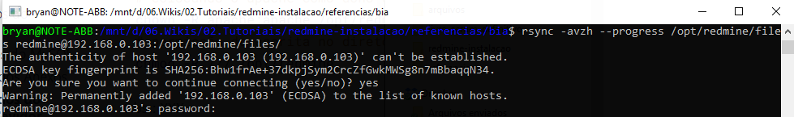
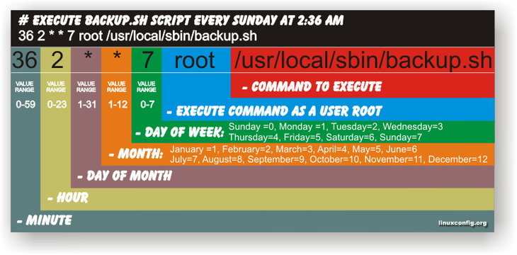

#  Administração do Redmine - Parte 2

> Autor: 1T (T) Anders - DAbM

[TOC]

##  1. Introdução
Este documento destina-se a orientação de administração do **Redmine** no sistema operacional **Oracle Linux 7+** com Banco de Dados **MySQL**. 

**Pré requisitos:**
- Sistema Operacional: **Oracle Linux 7.3+** com ao menos Interface gráfica selecionada.

## 2. Exportação dos dados do Redmine

Os backups do Redmine devem incluir:

- **dados** (armazenados em seu banco de dados redmine).
- **anexos** (armazenados no diretório `files` da sua instalação Redmine), ou entro local que tenha configurado no momento da instalação do Redmine, ver manual de instalação para isso.

###  2.1 Exportando dados do MySQL

Certifique de desativar temporariamente as ferramentas de segurança do Linux, a fim de evitar problemas no processo de backup do dados. Esses problemas são em grande parte silenciosos e podem ser causados por ferramentas como ACLs estendidas, **SELinux** ou AppArmor.

O comando`mysqldump` pode ser usado para fazer **backup** do conteúdo do banco de dados MySQL em um arquivo de texto. Por exemplo: 

```bash
# Script Autor: 1T (T) Anders
# sintaxe:
#/usr/bin/mysqldump -u <username> -p<password> -h <hostname> <redmine_database> > /path/to/backup/db/redmine.sql

# exemplo de uso:
# cria a pasta, ou substitua pela sua pasta onde está dump no seu servidor
mkdir -p /opt/redmine/backups/dump/
# configura a data
now=$(date +"%d_%m_%Y_%H%M%Sh")
# configura o arquivo
file_sql="/opt/redmine/backups/dump/backup_redmine_${now}.sql"
# Backup Database sem compactação
mysqldump -uroot -p<senha_root_mysql> redmine > "$file_sql"
# ou
mysqldump -uroot -p redmine > "$file_sql"
Enter password: *****
```

**Nota:** `dump` é uma palavra comum em banco de dados que representa um cópia (backup) do banco de dados.

### 2.2 Fazendo backup dos Anexos

Todos os uploads de arquivos são armazenados em `attachments_storage_path` (padrão para o diretório`files/`). Você pode caopiar o conteúdo desse diretório para outro local para fazer backup facilmente. 

**NOTA:** `attachments_storage_path`pode apontar para um diretório diferente que não seja `files/`. Certifique-se de verificar a configuração `config/configuration.yml` para evitar fazer um backup inútil. Se você seguiu o manual de instalação anterior, a pasta que contém o anexos do upload é o `/opt/redmine/files`. Caso esteja copiando para outro servidor não esqueça de colocar o **usuário** `apache` como dono do diretório `/opt/redmine`.

Neste cenário, o comando usado para fazer a cópia da pasta `/opt/redmine/files` é o **rsync**, pois além de copiar com mair rapidez, preserva links simbólicos, permissões de arquivos, posses usuário e grupo e timestamps, para mais informações acesse o site: [https://e-tinet.com/linux/sincronizacao-de-arquivos-no-linux-rsync/](https://e-tinet.com/linux/sincronizacao-de-arquivos-no-linux-rsync/)

```bash
# se não estiver instalado o rsync (para distribuições baseadas em Red Hat)
yum install rsync
# Backup do anexos em mesmo servidor (localmente)
rsync -a /opt/redmine/files /opt/redmine/backups/files
rsync -avzh --progress /opt/redmine/files /opt/redmine/backups/files

# colocando o apache como dono do diretório no outro servidor
chown -R apache:apache /opt/redmine
# permissão de escrita no diretório
chmod -R 777 /opt/redmine
```
## 3. Importação dos dados do Redmine para outro Sevidor  

### 3.1 Import DB Redmine no MySQL
Para importar o dump em algum banco de dados do MySQL, basicamente é utilizada a mesma sintaxe, porém  deve-se usar o comando `mysql`em vez do `mysqldump`. Também dev-se utilizar o símbolo da seta para esquerda '<' que indica o arquivo de entrada.

**NOTA 1:** O símbolo da seta para direita **'>',** representa um **arquivo de saída**. O símbolo da seta para esquerda **'<'**, representa um **arquivo de entrada**.

A seguir, podemos ver a sintaxe do comando para importar o arquivo de backup.

```bash
# copiando o arquivo sql de backup do servidor de produção 
# para o servidor do redmine instalado, o comando abaixo foi executado,
# partindo do princípio que o arquivo '.sql' está na mesma raiz do comando
rsync -avzh redmine.sql root@192.168.0.103:/opt/redmine/backups/dump/
# ou c/scp
scp redmine.sql redmine@192.168.0.103:/opt/redmine/backups/dump/

# sintaxe:
# mysql -uroot -p redmine_db < /path/to/backup/db/redmine.sql
# se ao restaurar não existir o banco de dados ocorrerá um erro conforme exemplo:
mysql -uroot -p redmine_db < redmine.sql 
Enter password: ****
ERROR 1049 (42000): Unknown database 'redmine_db'
# Caso já possua o banco do redmine, então entre c/nome do BD correto, conforme exemplo:
mysql -uroot -p redmine < redmine.sql 
Enter password: ****

# Só execute o comando abaixo caso você não tenha um banco de dados 
# já criada do redmine
# Para criar um banco de dados novo, execute: 
mysql -u root -p -e "create database test_redmine_db";
```

**NOTA 2:** Ao concluir a importação, **caso não exista** um usuário redmine, será necessário criar um novo usuário **redmine** e conceder os privilégios para que ele use o banco que foi importado. Se existir, basta somente conceder os privilégios, conforme código abaixo:

```bash
# acesse o banco msyql
mysql -uroot -p
Enter password: senha-do-root-do-mysql

# Passo 1- comando para 'criar o usuário' do redmine e senha. Nesta etapa é bom que seja criado o mesmo usuário e senha do redmine que foi criado no manual, para que não precise editar o arquivo de configurações do redmine a fim de repassar a senha nova.
# ---------------------------------------------
mysql> GRANT ALL PRIVILEGES ON redmine.* TO 'redmine'@'localhost' IDENTIFIED BY 'SenhaDoRedmine@2018';
# aplicando privilégios
mysql> FLUSH PRIVILEGES;

# ou
# Passo 2 - Caso já possua o usuário no novo banco de dados mysql, desconsidere o comando acima e execute o seguinte comando:
# ---------------------------------------------
mysql> GRANT ALL PRIVILEGES ON redmine.* to 'redmine'@'localhost';
mysql> FLUSH PRIVILEGES;
mysql> \q;
```

### 3.2 Restore do backup dos Anexos

Para copiar os anexos que são armazenados em `attachments_storage_path`(padrão para o diretório`files/`). Basta copiar conforme o item descrito no **Passo do item 2.2** para o novo Servidor e alterar para que o usuário **apache** seja dono da pasta em `attachments_storage_path` ( no manual de instalação foi `/opt/redmine`).

```bash
##################### SERVER REMOTE ##################
# Restore dos anexos de um servidor Remoto para o servidor onde está o redmine instalado
# com o user redmine
rsync -avzh --progress /opt/redmine/backups/files/ redmine@192.168.0.103:/opt/redmine/files/
# ou com user root
rsync -avzh opt/redmine/backups/files/ root@192.168.0.103:/opt/redmine/files/
root@192.168.0.103's password: ****
#
# Você pode copiar também com o scp, porém este nao irá preservar os direitos dos arquivos
scp -r /opt/redmine/backups/files/* redmine@192.168.0.103:/opt/redmine/files/
redmine@192.168.0.103's password: ****
##################### SERVER REMOTE ##################
# alterando a permissao dos arquivos caso necessite
chown -R apache:apache /opt/redmine
```



## 4. Rotinas de Backup no Servidor do Redmine 

Para executar **rotinas de tarefas** para fazer backup o Linux faz uso do **cron**. O cron pode ser interpretado como um serviço do Linux que é **carregado durante o processo de boot do sistema**. Trata-se de uma ferramenta que permite programar a execução de comandos e processos de maneira repetitiva ou apenas uma única vez. 

### Como usar o cron

O primeiro passo é abrir o **crontab**. Para isso, você pode usar editores de textos como **vi, emacs ou nano**. Também é possível digitar o **comando** `crontab -e` para editar o arquivo exclusivo de seu usuário. Neste caso, a edição é feita como se você estivesse usando o [vi](https://www.infowester.com/linuxvi.php). O crontab tem o seguinte formato:

`[minutos][horas] [dias do mês][mês] [dias da semana][usuário] [comando]`



O **crontab é multiusuário**, cada usuário que se conecta ao sistema pode, em tese, programar as próprias tarefas a serem executadas pelo sistema, editando o seu `crontab -e`. Entretanto para editar o **crontab do sistema** do servidor, basta editar o arquivo: `/etc/crontab`.

Antes de passar por cada passo deste tópico, vamos criar o diretório que conterá todos os backups que serão executados pelo crontab, execute os comandos abaixo.

```bash
# criando o diretório de backups em /opt/redmine
mkdir -p backups/

# esta pasta armazenará a aplicação que encontra-se em /var/www/redmine/ e
# os backups dos anexos do redmine - são arquivos que os usuário irão colocar ao usar a ferramento do redmine
mkdir -p backups/app_and_files
# esta pasta armazenará todos os backups do BD do redmine que o job irá processar
mkdir -p backups/dump
# alterando dono e permissao
chown apache. backups
chmod 777 backups
```

Para mais detalhes acesse https://www.infowester.com/linuxcron.php

### 4.1 Criando o script para executar o backup do BD

Crie o arquivo `vim /var/www/redmine/backup_db_redmine.sh`. Se desejar **visualizar e baixar** o script acesse, [backup_db_redmine.sh](scripts/backup_db_redmine.sh).

```bash
#!/bin/bash
# Script Autor: 1T (T) Anders

# nome do banco dados redmine a ser backupeado
REDMINE_DB_NAME=redmine
# login user redmine:
REDMINE_DB_USER=root
REDMINE_DB_PASS=Or@cle2018
# configura a data atual
NOW=$(date +"%d%m%Y_%H%M%Sh")
DAY=`date +"%d/%m/%Y"`
HOUR=`date +"%H:%M"`
# configura o arquivo
REDMINE_DB_BACKUP_FILE_SQL="/opt/redmine/backups/dump/backup_redmine_${NOW}.sql"
REDMINE_DB_BACKUP_FILE_BZ2="/opt/redmine/backups/dump/backup_redmine_${NOW}.tar.bz2"

# Backup Database sem compactação
echo "Snapshot backuping Redmine MySQL db:${REDMINE_DB_NAME} - data: ${DAY}-${HOUR}"
mysqldump --user=$REDMINE_DB_USER --password=$REDMINE_DB_PASS $REDMINE_DB_NAME > $REDMINE_DB_BACKUP_FILE_SQL
echo "($REDMINE_DB_BACKUP) done."
echo
echo "Compacting file: ${REDMINE_DB_BACKUP_FILE_SQL} MySQL db into Redmine instance..."
# Compactando o arquivo SQL
tar -cjf $REDMINE_DB_BACKUP_FILE_BZ2 $REDMINE_DB_BACKUP_FILE_SQL
# para descompactar:
# tar -jxvf redmine_20180723_0218.tar.bz2

# -- Purging old outdated backups
echo
echo "Purging SQL Plain backups..."
rm -rf $REDMINE_DB_BACKUP_FILE_SQL
echo "done."
```

Executar pemissões no arquivo de **backup.sh**. `chmod 777 /var/www/redmine/backup_db_redmine.sh`

### 4.2 Criando o script para executar o backup dos diretórios do Redmine

Crie o arquivo `vim /opt/redmine/scripts/backup_files_redmine.sh`. Se desejar **visualizar e baixar** o script acesse XXXX

```sh
#!/bin/bash
# Script Autor: 1T (T) Anders
#
###########################################################################
###########################################################################
# VARS DE BACKUP
DAY=`date +"%Y%m%d"`
HOUR=`date +"%H%M"`
BACKUP_PATH="/opt/redmine/backups"
BACKUP_PATH_APP="app_and_files"
BACKUP_LIVE_TIME="30"
BACKUP_HISTO_LIVE_TIME="180"
# VARS DE LOCALIZACO DO REDMINE E DO FILES, CASO ESTEJA SEPARADO
REDMINE_HOME="/var/www/redmine"
REDMINE_FILES="/opt/redmine/files"
REDMINE_BACKUP_HOME="home_redmine_"$DAY"_"$HOUR".tar.bz2"
REDMINE_BACKUP_FILES="files_redmine_"$DAY"_"$HOUR".tar.bz2"
REDMINE_BACKUP_HISTO_HOME="mensal_home_redmine_"$DAY"_"$HOUR".tar.bz2"
REDMINE_BACKUP_HISTO_FILES="mensal_files_redmine_"$DAY"_"$HOUR".tar.bz2"
# estrategia dos bkp diarios
MODEL_BKP_DAILY_HOME="home_redmine_*.tar.bz2"
MODEL_BKP_DAILY_FILES="files_redmine_*.tar.bz2"
# estrategia busca bkp mensais
MODEL_BKP_HISTO_HOME="mensal_home_redmine_*.tar.bz2"
MODEL_BKP_HISTO_FILES="mensal_files_redmine_*.tar.bz2"
# retorna a versao do Oracle Linux
###########################################################################
VERSION_SO=`cat /etc/oracle-release`
TOMORROW=`date --date=tomorrow +%d`
###########################################################################

# Rotina principal do script e chamada na ordem abaixo do arquivo
main() {
	echo "----- Rotina de Backup do Redmine no Servidor: ${VERSION_SO} -----"

	bkp_daily_dir_redmine
    bkp_daily_dir_redmine_files
    bkp_monthly_dir_redmine
    bkp_monthly_dir_redmine_files
    remove_daily_dir_redmine_files
    remove_monthly_dir_redmine_files

	echo "----- Rotina de Backup Concluído ----- "
}

############### bloco 1
# Fazendo backup diário dir do Redmine antes de enviá-lo para um local remoto ...
bkp_daily_dir_redmine() 
{
    echo
    echo "Realizando backup diário diretório 'Redmine', antes de enviar para um local remoto..."
    tar -cjf $BACKUP_PATH/$BACKUP_PATH_APP/$REDMINE_BACKUP_HOME $REDMINE_HOME
    echo "arquivo: '$BACKUP_PATH/$BACKUP_PATH_APP/$REDMINE_BACKUP_HOME' pronto."
}

# Anexos enviados pelos usuarios da ferrmenta
bkp_daily_dir_redmine_files() 
{
    echo
    echo "Realizando backup diário diretório do 'files', antes de enviar para um local remoto..."
    tar -cjf $BACKUP_PATH/$BACKUP_PATH_APP/$REDMINE_BACKUP_FILES $REDMINE_FILES
    echo "arquivo: '$BACKUP_PATH/$BACKUP_PATH_APP/$REDMINE_BACKUP_FILES' pronto."
}

############### bloco 2
# faz uma cópia do backup do ultimo dia do mês para pasta mensal de backups
bkp_monthly_dir_redmine() 
{
    if [ $TOMORROW -eq "1" ]; then
        echo
        echo "fim do mês : Realizando backup mensal do diretório Redmine..."
        
        cp $BACKUP_PATH/$BACKUP_PATH_APP/$REDMINE_BACKUP_HOME $BACKUP_PATH/$BACKUP_PATH_APP/$REDMINE_BACKUP_HISTO_HOME
        
        echo "arquivo: '$BACKUP_PATH/$BACKUP_PATH_APP/$REDMINE_BACKUP_HISTO_HOME' pronto."
    fi
}
# faz uma cópia do backup do ultimo dia do mês para pasta mensal de backups
bkp_monthly_dir_redmine_files() 
{
    if [ $TOMORROW -eq "1" ]; then
        echo
        echo "fim do mês : Realizando backup mensal do diretório file..."

        cp $BACKUP_PATH/$BACKUP_PATH_APP/$REDMINE_BACKUP_FILES $BACKUP_PATH/$BACKUP_PATH_APP/$REDMINE_BACKUP_HISTO_FILES

        echo "arquivo: '$BACKUP_PATH/$BACKUP_PATH_APP/$REDMINE_BACKUP_HISTO_FILES' pronto."
    fi
}

############### bloco 3
# Removendo backups desatualizados antigos da pasta HOME acima de 30 dias
remove_daily_dir_redmine_files() 
{
    echo
    echo "Removendo backups diários antigos da pasta 'Redmine' acima de 30 dias..."
    # localizar e remover backups diários modificados acima de 30 dias
    find $BACKUP_PATH/$BACKUP_PATH_APP/$MODEL_BKP_DAILY_HOME -mtime +$BACKUP_LIVE_TIME -exec rm {} \;

    echo "Removendo backups diários antigos da pasta 'files' acima de 30 dias..."
    # localizar e remover backups diários modificados acima de 30 dias
    find $BACKUP_PATH/$BACKUP_PATH_APP/$MODEL_BKP_DAILY_FILES -mtime +$BACKUP_LIVE_TIME -exec rm {} \;
    
    echo "pronto."
}

# Removendo backups desatualizados antigos da pasta HOME
remove_monthly_dir_redmine_files() 
{
    echo
    echo "Removendo backups mensais antigos da pasta 'redmine' acima de 180 dias..."    
    # localizar e remover backups mensais modificados acima de 180 dias
    find $BACKUP_PATH/$BACKUP_PATH_APP/$MODEL_BKP_HISTO_HOME -mtime +$BACKUP_HISTO_LIVE_TIME -exec rm {} \;
    
    echo "Removendo backups mensais antigos da pasta 'files' acima de 180 dias..."
    find $BACKUP_PATH/$BACKUP_PATH_APP/$MODEL_BKP_HISTO_FILES -mtime +$BACKUP_HISTO_LIVE_TIME -exec rm {} \;
    echo "pronto."
}

#chamando rotine principal
main
exit 0
```

### 4.3 Criando os jobs de backup dos scripts no crontab do servidor

Para criar uma tarefa para ser executado pelo servidor, vamos criar um diretório `scripts` dentro do `/opt/redmine`de modo que tenhamos os **scripts** que irão rodar ao ser chamado o crontab do sistema linux. No **Passo 7.1** criamos o arquivo backup do banco de dados MySQL no diretório `/var/www/redmine/backup_db_redmine.sh`, vamos <u>mover</u> desse diretório para que possamos concentrar todas as alterações em diretórios <u>fora</u> do diretório **raiz do redmine**, de modo que em caso de um **futuro upgrade do redmine** não venhamos a perder esses arquivos, bastando só fazer o backup da pasta `/opt/redmine/backups`. execute os passos com usuário **root**.

```bash
cd /opt/redmine
# criar pasta
mkdir -p scripts
# alterar o dono
chown -R apache. scripts
# mover o arquivo da etapa anterior: Passo 7.1
mv /var/www/redmine/backup_db_redmine.sh /opt/redmine/scripts/
# editar o arquivo para conter os dados do usuário do mysql e senha
vim /opt/redmine/scripts/backup_db_redmine.sh
# após as alterações, vamos torná-lo executável por todos
chmod +x /opt/redmine/scripts/backup_db_redmine.sh
# se quiser pode até alterar o dono do arquivo para o usuário redmine
chown redmine:apache /opt/redmine/scripts/backup_db_redmine.sh
# necessário para que seja gravado o arquivo do backup do BD
chmod 777 /opt/redmine/backups/dump
# necessário para que seja gravado o log de execução backup
chmod 777 /opt/redmine/scripts

# checando as alterações
[16:36] root@localhost /opt/redmine/scripts
$ ls -lha
total 8,0K
drwxr-xr-x 2 apache  apache   33 Jul 25 16:32 .
drwxrwxrwx 8 apache  apache 4,0K Jul 25 16:13 ..
-rwxr-xr-x 1 redmine apache 1016 Jul 25 16:32 backup_db_redmine.sh
```

Para adicionar o <u>script</u> no **crontab do servidor**, proceda da seguinte maneira:

- Edite o arquivo: `vim /etc/crontab`, adiconando o conteúdo abaixo no final do arquivo, perceba que é uma boa prática colocar os comentários para que fique de fácil visualização para que for administrar o servidor, lembre-se também de dizer qual o usuário que vai executar o comando, visto que estamos editando o arquivo `/etc/crontab`do servidor, se fosse executado o comando `crontab -e` do usuário **root**, não precisaria colocar qual o usuário, pois o sistema reconhece que o comando é referente o **usuário logado no servidor**, como estamos no com o root seria o **crontab do root**. Outro motivo que é melhor colocar as rotinas em `/etc/crontab`, é porque caso sem <u>intenção</u> o usuário digite o comando `crontab -r` todos os jobs do arquivo seriam deletados.

```sh
#################################################################
# ROTINAS ADMINSITRATIVAS BKP REDMINE                           #
#################################################################
# Rotina de Backup de seg à sex às 18hs com saída para o log da execução
00 18 * * 1-5 root /opt/redmine/scripts/backup_db_redmine.sh > /opt/redmine/scripts/backup_db_redmine.log 2>&1

# Rotina de Backup da pasta Redmine e files de seg à sex às 18hs com saída para o log da execução
00 20 * * 1-5 root /opt/redmine/scripts/backup_files_redmine.sh > /opt/redmine/scripts/backup_files_redmine.sh.log 2>&1
#################################################################
# FIM DE ROTINAS DE BKP DO REMINE                               #
#################################################################
```

Exemplo do **arquivo completo**: `cat /etc/crontab`:

```sh
SHELL=/bin/bash
PATH=/sbin:/bin:/usr/sbin:/usr/bin
MAILTO=root
HOME=/

# For details see man 4 crontabs

# Example of job definition:
# .---------------- minute (0 - 59)
# |  .------------- hour (0 - 23)
# |  |  .---------- day of month (1 - 31)
# |  |  |  .------- month (1 - 12) OR jan,feb,mar,apr ...
# |  |  |  |  .---- day of week (0 - 6) (Sunday=0 or 7) OR sun,mon,tue,wed,thu,fri,sat
# |  |  |  |  |
# *  *  *  *  * user-name  command to be executed

#--------------------------------------------------------------------#
# min - hora - dia(1-31) - mes(1-12) - dia semana (0-6 => 0=Domingo) #
#--------------------------------------------------------------------#

#################################################################
# ROTINAS ADMINSITRATIVAS BKP REDMINE                           #
#################################################################
# Rotina de Backup de seg à sex às 18hs com saída para o log da execução
00 18 * * 1-5 root /opt/redmine/scripts/backup_db_redmine.sh > /opt/redmine/scripts/backup_db_redmine.log 2>&1

# Rotina de Backup da pasta Redmine e files de seg à sex às 18hs com saída para o log da execução
00 20 * * 1-5 root /opt/redmine/scripts/backup_files_redmine.sh > /opt/redmine/scripts/backup_files_redmine.sh.log 2>&1
#################################################################
# FIM DE ROTINAS DE BKP DO REMINE                               #
#################################################################
```

- Verfique se o serviço do crontab está rodando, com o comando: `service crond status`, caso não esteja, inicie com: `service crond start`, se desejar reiniciar, execute `service crond restart`. Na edição do arquivo, não é necessário reiniciar o serviço caso já esteja iniciado.

## 5. Referências e Links

- http://www.redmine.org/projects/redmine/wiki/RedmineBackupRestore
- https://e-tinet.com/linux/sincronizacao-de-arquivos-no-linux-rsync/
- https://www.cyberciti.biz/tips/shell-scripting-creating-reportlog-file-names-with-date-in-filename.html
- https://gist.github.com/gabrielkfr/6432185